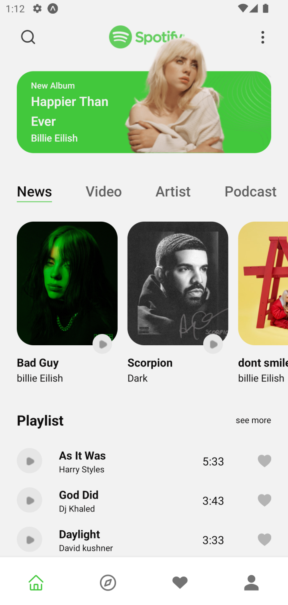

# Spotify Redesign 
<br/>




# Sobre


O redesign do Spotify apresenta uma interface clara e moderna, com suporte para dark e light themes, desenvolvido em expo. Oferecendo uma experiência intuitiva e personalizável para os usuários, mantendo a simplicidade e a elegância


# Tecnologias

* [expo](https://expo.dev)
* [nativeWind](https://www.nativewind.dev)
* [react-navigation](https://www.google.com/search?q=react+nagivation&sourceid=chrome&ie=UTF-8)
* [typescript](https://www.typescriptlang.org)


# Design do Projeto

* Ui feito por: [Soroush norozy](https://www.instagram.com/Soroushnrz.ui)
* [Ui](https://www.figma.com/community/file/1166665330965959412/spotify-redesign-free-ui-kit-light)


# Como Usar

### Clone esse repositório
```sh
git clone https://github.com/Josue-Js/Spotify-Redesign
```

### ir pasta

```sh 
cd Spotify-Redesign
```

### instalar dependencies

```sh 
yarn or npm install 
```

### executar projeto

```sh
npx expo start
```
